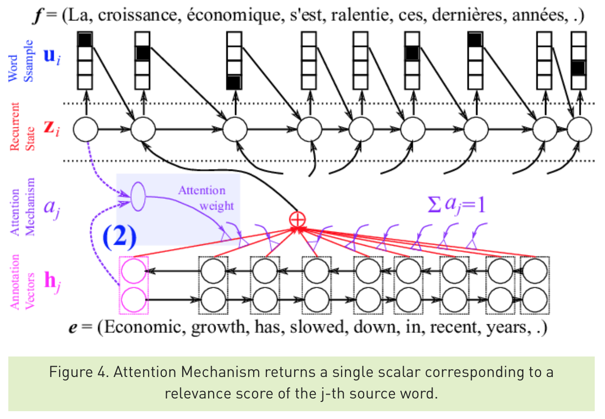
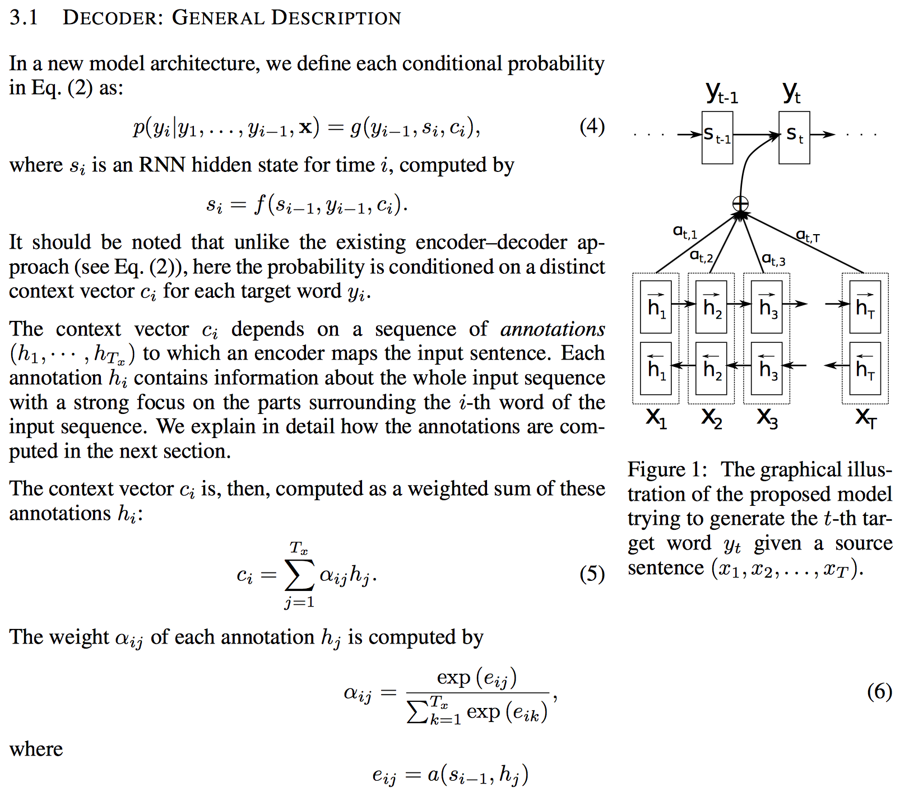
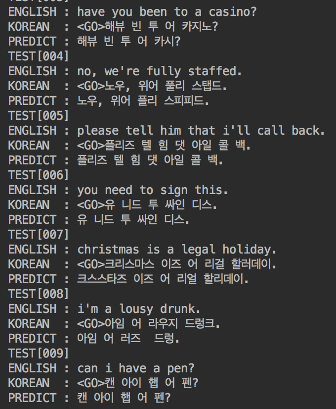
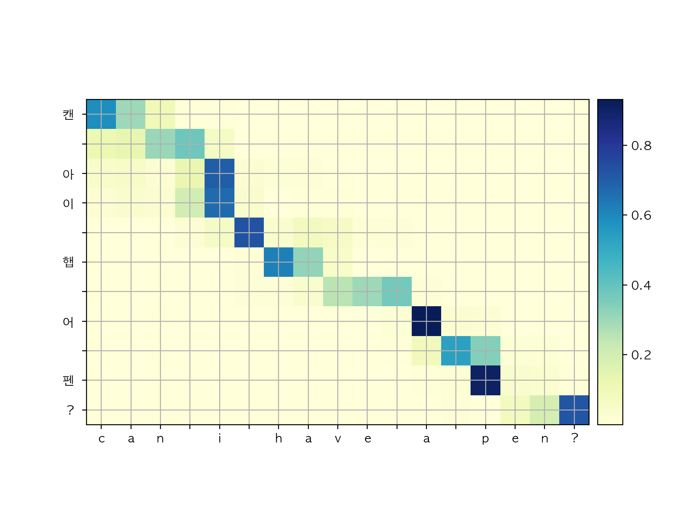
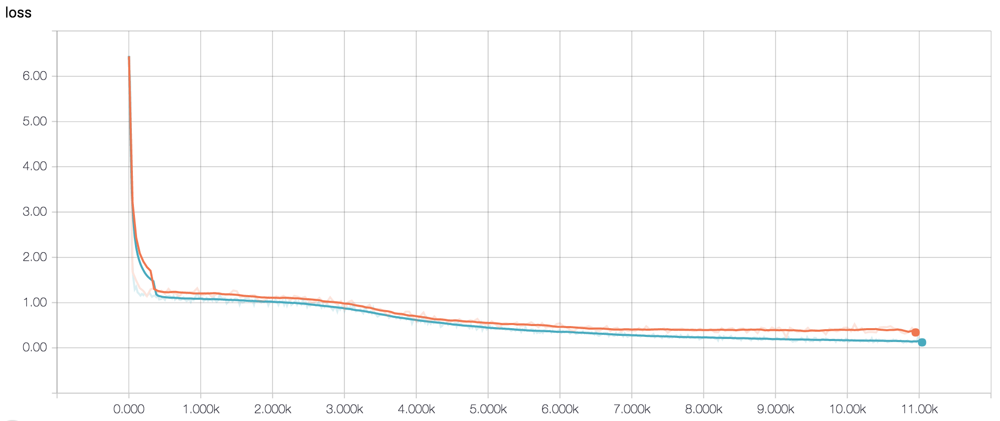

# Implementation of Custom Seq2Seq Model for Machine Translation using Tensorflow  
#### (This model converts english spelling to korean pronunciation.)  
  
#### cuteboydot@gmail.com    
  
#### reference  
1. [NEURAL MACHINE TRANSLATION BY JOINTLY LEARNING TO ALIGN AND TRANSLATE, Bahdanau](https://arxiv.org/pdf/1409.0473.pdf)  
2. [Introduction to Neural Machine Translation with GPUs](https://devblogs.nvidia.com/introduction-neural-machine-translation-gpus-part-3/)
3. [How to Visualize Your Recurrent Neural Network with Attention in Keras](https://medium.com/datalogue/attention-in-keras-1892773a4f22)
  
#### data reference  
1. [네이버 글로벌회화](http://phrasebook.naver.com/detail.nhn?bigCategoryNo=2&targetLanguage=en)  
  
### 1. Seq2Seq Model  
Seq2Seq model을 직접 구현해 본다.  
Tensorflow에서 제공하는 Seq2Seq 라이브러리를 이용한 구현방법은  
[Char-level-Neural-Machine-Translation-using-Attention-Mechanism](https://github.com/cuteboydot/Char-level-Neural-Machine-Translation-using-Attention-Mechanism)에 구현되어있다.  
  
본 프로젝트는 위 프로젝트와 동일한 Seq2Seq (encoder-attention-decoder) 모델을 직접 구현한다.  
입력 데이터는 영어 문장이고, 출력 데이터는 한국어 독음 문장이다.  
RNN encoder을 통해 얻은 encode_output, encode_stat를 입력으로 받고, RNN decoder의 output(나의 예측값)과 입력값 사이의 가중치(attend)를 이용하여 학습한다.  
  
  
  
  
  
### 2. Seq2Seq Model  
#### 2.1 실험 결과는 다음과 같다.  
  
  
  
#### 2.2 Training loss  
  